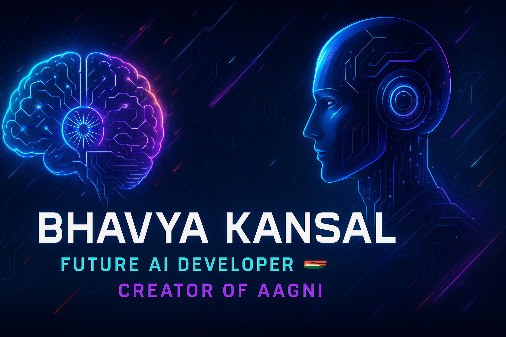

  

<h1 align="center">
  
</h1>

---

## 👨‍💻 About Me

> 🧠 I’m Bhavya Kansal — a passionate **AI developer** working on real-time futuristic systems like voice assistants, gesture control, and predictive AI.  
> ⚡ My projects aren't just cool — they’re a glimpse of what **India’s tech future** looks like.  
> 🚀 Let's not wait for the future... let's **build it**.
> **Jai Hind 🇮🇳**
---

## 🚀 Tech Arsenal

| Domain        | Tools & Skills |
|---------------|----------------|
| **Languages** | **Python, JavaScript, Java, HTML/CSS** |
| **AI/ML/DL**  | **Machine Learning , Deep learning , Generative AI**|
| **Libraries** | **Tensorflow , OpenCV , Scikit learn , Keras , Numpy , Pandas** |
| **Frontend**  | **HTML , React.js, Tailwind CSS , Python Framework**|
| **Backend**   | **Python, Node.js, Express.js, FastAPI** |
| **Voice AI**  | **gTTS, pygame, SpeechRecognition** |
| **Tools**     | **GitHub, VSCode, Docker, Render, Pycharm** |

---

## 🔥 Projects that Define Me

- 🔥 **AAGNI AI** – India’s AI Assistant: Voice + Advance AI-powered 🤖  
- 🧤 **Gesture Control** – Control Advance systems like Iron Man style  
- 🔮 **AI Predictions Engine** – Predict the future with ML  
- 🎮 Mini Games – Custom coded Wordle, TicTacToe, and more 
- 🕉️ **Spiritual Synthesizer** – Turn bhajans into custom video bhakti

---

## 🌟 Currently Learning

- 🤖 Deep Learning (NLP, CV, Transformers)  
- 🧬 Robotics (from scratch)  
- 🔐 Cybersecurity fundamentals  
- ☁️ Cloud Deployment (Render, Fly.io, Vercel)

---

## 🧭 Vision

> India will lead the AI Revolution.  
> I will be one of the builders of that future.  
> AAGNI is just **step one**.  
> _“Let the world see what Indian tech can do.” 🇮🇳_

---

## 🔗 Connect With Me

  
  
  
  

---

  
  

---

<h3 align="center">⚡ Powered by Code, Fueled by Vision. Jai Hind. 🇮🇳</h3>
